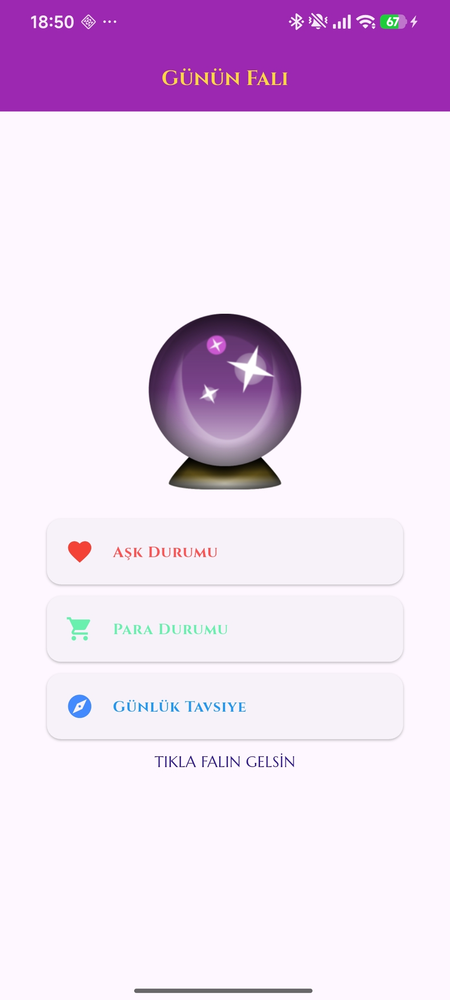
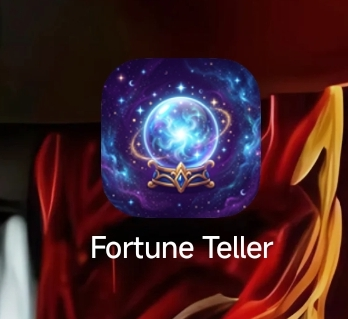
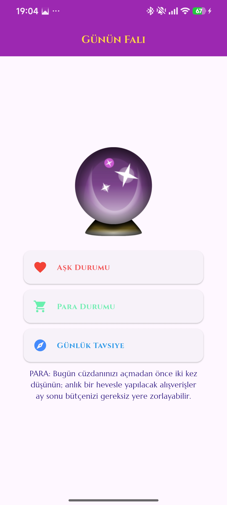

# 🔮 Fortune Telling App

A simple Flutter fortune-telling application built from scratch as a learning project.

The application provides random predictions in three different categories: **Love, Money, and Daily Advice.**

## 📱 Preview



## 🎥 Demo

A short demonstration of the application and its interactive fortune-telling features.

[▶️ Watch the demo video](assets/demorecordings/screenrecorder/screenrecorder_1.mp4)

## ✨ Features

* ❤️ Random love predictions
* 💰 Random money predictions
* 🧭 Daily advice
* 🎲 Randomized results for each category
* 🔮 Simple fortune-telling interface
* 📱 Mobile-focused Flutter UI
* 🎨 Custom typography using Google Fonts
* 🖼️ Custom application artwork

## 📸 Screenshots

### App İcon



### Main Screen


### Fortune Result



## 🧠 How It Works

The application uses a simple state-based approach to generate different fortune results.

Each category has its own collection of predefined responses. When the user selects a category, the application randomly selects a response from the corresponding collection and updates the displayed result.

The three available categories are:

* **Love** — randomly selects a love-related prediction.
* **Money** — randomly selects a money-related prediction.
* **Daily Advice** — randomly selects a daily recommendation.

The application uses Flutter's `setState()` to update the displayed fortune after each selection.

## 🛠️ Tech Stack

* **Flutter**
* **Dart**
* **Android Studio**
* **Google Fonts**

## 📂 Project Structure

```text
fortune-telling-app/
├── android/
├── assets/
│   └── screenpicture/
│       ├── falci.png
│       ├── SCREENSHOT_1.png
│       ├── SCREENSHOT_2.png
│       └── DEMO.mp4
├── ios/
├── lib/
│   └── main.dart
├── .gitignore
├── analysis_options.yaml
├── pubspec.lock
├── pubspec.yaml
└── README.md
```

The main application logic is contained in `lib/main.dart`.

Application artwork, screenshots, and demonstration media are stored under `assets/screenpicture/`.

## 🚀 Getting Started

### Requirements

To run this project, you will need:

* Flutter SDK
* Dart SDK
* Android Studio
* An Android device or emulator

### Installation

Clone the repository:

```bash
git clone https://github.com/efehanmert/fortune-telling-app.git
```

Navigate to the project directory:

```bash
cd fortune-telling-app
```

Install the dependencies:

```bash
flutter pub get
```

Run the application:

```bash
flutter run
```

## 🎯 Project Purpose

This project was built as a hands-on Flutter learning project to practice creating a complete stateful mobile application independently.

The project focuses on:

* Flutter UI development
* Stateful widgets
* State management with `setState()`
* Lists and collections
* Random number generation
* User interaction
* Asset management
* Custom fonts
* Git and GitHub workflow

## 📌 Project Status

**Completed**

The first complete version of the application has been finished, including its user interface, fortune categories, randomized results, visual assets, and application icon.

## 👨‍💻 Author

**Efehan Mert**

📧 [mertefehan2010@gmail.com](mailto:business.efehan@gmail.com)

GitHub: [@efehanmert](https://github.com/efehanmert)
